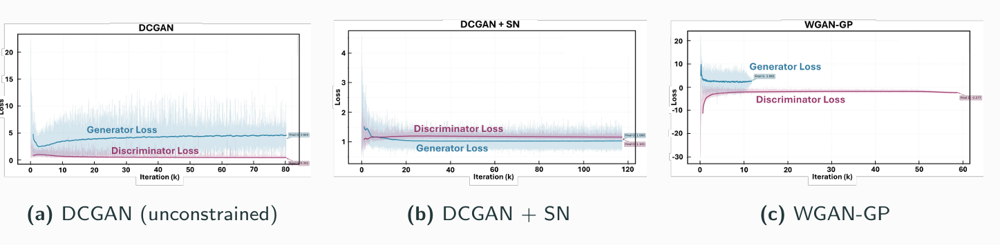
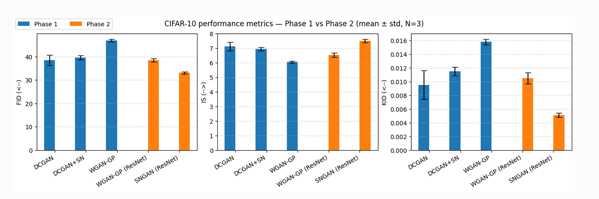
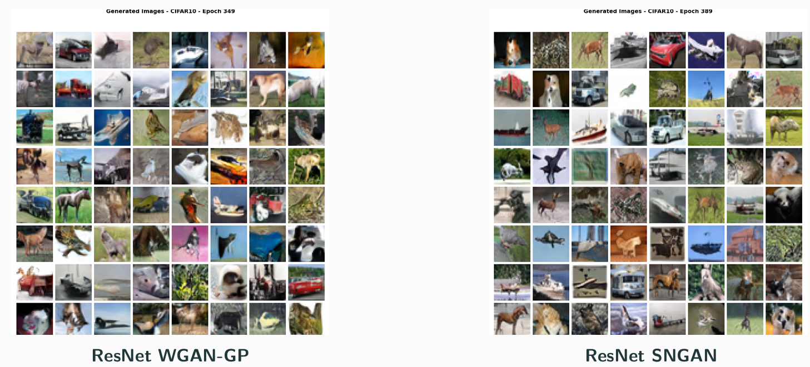
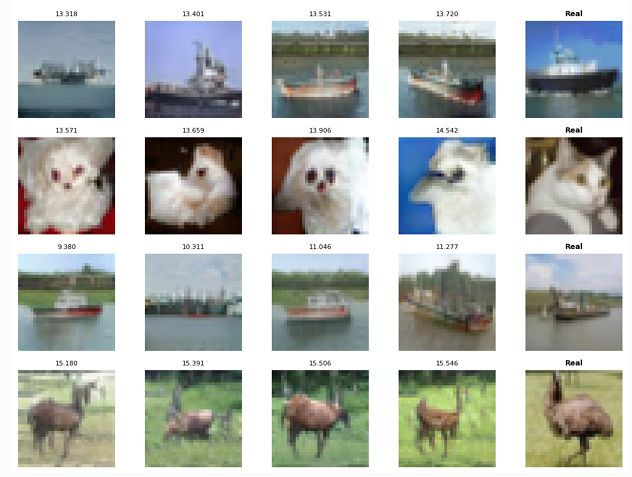
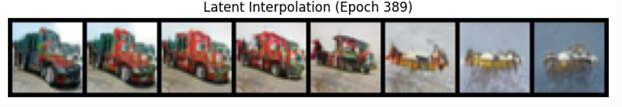

# Stabilizing Generative Adversarial Networks
### A Comparative Study of Architectures and Loss Functions

Bachelor's thesis in Data Analytics at the University of Campania "Luigi Vanvitelli".

## Overview

Generative Adversarial Networks (GANs) can produce high-quality synthetic images, but their adversarial training dynamics are highly sensitive to architecture, loss formulation, regularization, and optimization choices.

This project investigates a central trade-off in GAN training:

> **Can training stability be improved without excessively restricting model expressivity and sample quality?**

The study compares penalty-based and structural stabilization strategies across both convolutional and high-capacity Residual Network architectures.

The experimental design was structured in two phases to separate the effect of the **stabilization mechanism** from the effect of **model capacity**.

---

## Research Questions

The study focuses on three main questions:

1. Does the increased stability of **WGAN-GP** translate into better generative performance when model capacity is held approximately constant?

2. Can **Spectral Normalization** provide a better stability–quality trade-off than Gradient Penalty in convolutional GANs?

3. When model capacity is increased through **Residual Networks**, does WGAN-GP recover its performance, or does a structurally constrained **SNGAN** remain more effective?

---

## Experimental Design

### Phase 1 — Controlled Convolutional Comparison

A capacity-enhanced DCGAN backbone was used as a common experimental baseline on CIFAR-10.

The architecture was deliberately kept comparable across experiments so that performance differences could be attributed primarily to the stabilization strategy rather than to network depth or width.

Three configurations were evaluated:

- **DCGAN**  
  Unconstrained convolutional baseline using the standard non-saturating GAN objective.

- **WGAN-GP**  
  Wasserstein objective with Gradient Penalty and a 5:1 critic-to-generator update schedule.

- **DCGAN + Spectral Normalization**  
  Same convolutional regime with Spectral Normalization applied to the discriminator while retaining the standard GAN objective.

*Training dynamics for the shared convolutional backbone. The unconstrained DCGAN exhibits unstable and divergent adversarial behaviour, while DCGAN+SN and WGAN-GP remain bounded.*

### Phase 2 — Scaling to Residual Networks

The second phase investigated whether greater architectural capacity could overcome the performance limitations observed with penalty-based stabilization.

Two high-capacity ResNet configurations were compared:

- **ResNet WGAN-GP**
- **ResNet SNGAN**, combining Spectral Normalization with Hinge Loss

The generator architecture was shared across the two Phase 2 experiments, while the critics were matched in depth and feature-map progression to enable a controlled comparison of the stabilization mechanisms.

---

## Models Evaluated

| Phase | Architecture | Stabilization / Objective |
|---|---|---|
| 1 | DCGAN | None / BCE |
| 1 | WGAN-GP | Gradient Penalty / Wasserstein loss |
| 1 | DCGAN + SN | Spectral Normalization / BCE |
| 2 | ResNet WGAN-GP | Gradient Penalty / Wasserstein loss |
| 2 | ResNet SNGAN | Spectral Normalization / Hinge loss |

---

## Datasets

### CIFAR-10

The primary benchmark consisted of 50,000 training images from CIFAR-10:

- 32×32 RGB images
- 10 object classes
- substantial intra-class variability
- used for both Phase 1 and Phase 2

CIFAR-10 served as the main stress test for training stability, sample fidelity, diversity, and mode coverage.

### MNIST

MNIST was used as a lower-complexity validation dataset for the convolutional training pipelines.

Because standard Inception-based metrics are poorly suited to grayscale handwritten digits, MNIST experiments were evaluated primarily through training diagnostics and qualitative analysis rather than FID, KID, and Inception Score.

---

## Training and Evaluation

All models were implemented in **PyTorch**.

The experimental pipeline included:

- Exponential Moving Average (EMA) of generator weights
- fixed latent vectors for consistent qualitative monitoring
- architecture-specific optimization strategies
- CIFAR-10 data augmentation
- latent-space interpolation
- nearest-neighbour analysis to detect memorization
- multiple random seeds for robustness analysis

### Quantitative Metrics

Performance on CIFAR-10 was evaluated using:

- **Fréchet Inception Distance (FID)** ↓
- **Kernel Inception Distance (KID)** ↓
- **Inception Score (IS)** ↑

### Training Diagnostics

Different diagnostics were used according to the model objective.

**DCGAN / DCGAN + SN**
- discriminator confidence on real samples
- discriminator confidence on generated samples
- generator and discriminator losses

**WGAN-GP**
- critic scores
- critic gap
- Gradient Penalty
- Wasserstein-distance proxy

**SNGAN**
- critic scores
- hinge margins
- critic gap
- real/fake score separation

---

# Results

## Phase 1 — Convolutional Architectures

Results represent mean ± standard deviation across three random seeds.

| Architecture | Constraint | FID ↓ | IS ↑ | KID ↓ | D/G Updates |
|---|---|---:|---:|---:|---:|
| DCGAN | None | **38.45 ± 2.15** | **7.12 ± 0.30** | **0.0095 ± 0.0021** | 1:1 |
| WGAN-GP | Gradient Penalty | 46.92 ± 0.55 | 6.05 ± 0.08 | 0.0158 ± 0.0004 | 5:1 |
| DCGAN + SN | Spectral Normalization | 39.55 ± 0.92 | 6.95 ± 0.12 | 0.0115 ± 0.0006 | 1:1 |

### Interpretation

The unconstrained DCGAN achieved strong sample quality but showed the highest variability across random initializations and unstable training dynamics.

WGAN-GP produced more stable training and lower run-to-run variance, but this came with a substantial reduction in generative quality.

Adding Spectral Normalization to the convolutional baseline recovered most of the performance of the unconstrained DCGAN while retaining considerably more stable training.

These results motivated the second experimental phase: testing whether increased architectural capacity could allow penalty-based stabilization to recover the lost performance.

---

## Phase 2 — Residual Networks

| Architecture | Constraint | FID ↓ | IS ↑ | KID ↓ | D/G Updates |
|---|---|---:|---:|---:|---:|
| ResNet WGAN-GP | Gradient Penalty | 38.55 ± 0.75 | 6.52 ± 0.15 | 0.0105 ± 0.0008 | 5:1 |
| **ResNet SNGAN** | **Spectral Normalization** | **33.12 ± 0.42** | **7.51 ± 0.11** | **0.0051 ± 0.0003** | **1:1** |

*CIFAR-10 performance across convolutional and ResNet architectures. Results are reported as mean ± standard deviation over three runs. Lower is better for FID and KID; higher is better for Inception Score.*

### Main Finding

Increasing model capacity substantially improved WGAN-GP compared with its convolutional version.

However, the **ResNet SNGAN remained clearly superior across FID, KID, and Inception Score**.

In these experiments, combining **Spectral Normalization with Hinge Loss** provided the strongest overall trade-off between:

- training stability
- sample fidelity
- sample diversity
- optimization efficiency

It also operated with a **1:1 discriminator-to-generator update schedule**, compared with the 5:1 critic schedule used by WGAN-GP.

*Representative CIFAR-10 samples generated by the two Phase 2 architectures. In these experiments, ResNet SNGAN produces sharper textures and finer high-frequency detail than ResNet WGAN-GP.*

---

## Qualitative Evaluation

Quantitative metrics were complemented by visual diagnostics designed to evaluate properties that cannot be captured reliably by a single scalar metric.

The analysis included:

- generated sample grids
- latent-space interpolation
- nearest-neighbour comparison with training images

### Nearest-Neighbour Analysis

Nearest-neighbour comparisons were used as a sanity check against memorization.

Generated samples were compared with visually similar examples from the training set. The generated images shared semantic characteristics with their nearest neighbours but were not identical copies, supporting the interpretation that the models learned to synthesize new samples rather than directly reproducing training observations.

*Nearest-neighbour analysis for the ResNet SNGAN. Generated samples are visually similar to training examples but not identical, providing evidence against direct memorization.*

### Latent-Space Interpolation

Linear interpolation between latent vectors was used to inspect the continuity of the learned generative manifold.

Smooth transformations between generated samples suggest that nearby points in latent space map to progressively changing outputs rather than disconnected or abrupt transitions.

*Latent-space interpolation for the ResNet SNGAN. Smooth transitions between generated samples suggest a structured and coherent learned latent manifold.*

---

## Reproducibility

The main experiments were repeated using three random seeds:

`42`, `101`, `999`

Reported quantitative results show **mean ± standard deviation** across these runs.

Because GAN training is highly stochastic and only three independent runs were computationally feasible, these results should be interpreted as **empirical evidence rather than formal statistical significance**.

Additional reproducibility measures included:

- EMA decay: `0.999`
- deterministic settings where feasible
- consistent preprocessing pipelines
- matched architectures within each experimental phase
- fixed latent vectors for qualitative monitoring

### Computational Environment

Experiments were run using Google Colab with:

- **NVIDIA A100 40 GB**
- **NVIDIA L4 24 GB**

---

## Technologies

- Python
- PyTorch
- Deep Learning
- Generative Adversarial Networks
- Convolutional Neural Networks
- Residual Networks
- Spectral Normalization
- Wasserstein GANs
- Gradient Penalty
- Hinge Loss
- Computer Vision
- Model Evaluation

---

## Thesis Information

**Bachelor's Degree in Data Analytics**  
University of Campania "Luigi Vanvitelli"  
Academic Year 2024–2025

**Thesis:**  
*Stabilizing Generative Adversarial Networks: A Comparative Study of Architectures and Loss Functions*
